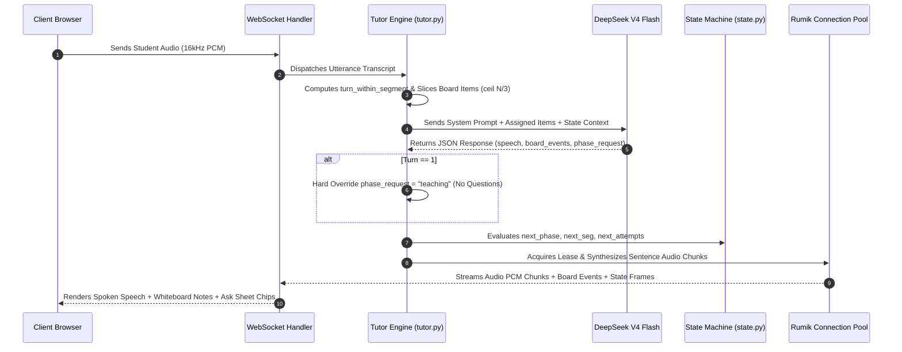

# 🎙️ `app/drona/` — Drona AI Tutoring Engine

The `app/drona/` directory is the core intelligence hub of **Drona**. It manages lesson plan generation, spoken turn streaming, state-machine pacing, WebSockets PCM audio streaming, and Rumik Silk TTS connection leasing pools.

---

## 📂 Core Module Breakdown

| Module | Primary Responsibility | Key Functions / Classes |
|---|---|---|
| [`planner.py`](file:///Users/raasikhnaveed/Desktop/monk-learning-api/app/drona/planner.py) | Authors 6–9 segment lesson plans grounded in vector RAG | `get_or_create_plan()`, `validate_plan_json()` |
| [`tutor.py`](file:///Users/raasikhnaveed/Desktop/monk-learning-api/app/drona/tutor.py) | Spoken turn streaming engine & board item assignment | `process_tutor_turn_stream()` |
| [`state.py`](file:///Users/raasikhnaveed/Desktop/monk-learning-api/app/drona/state.py) | Session state machine (phase, segment, attempts) | `compute_next_session_state()` |
| [`voice_proxy.py`](file:///Users/raasikhnaveed/Desktop/monk-learning-api/app/drona/voice_proxy.py) | STT & Rumik Silk TTS connection pool (60s lease) | `RumikConnectionPool`, `FillerAudioCache` |
| [`live_session_ws.py`](file:///Users/raasikhnaveed/Desktop/monk-learning-api/app/drona/live_session_ws.py) | Live WebSocket endpoint streaming PCM audio & events | `drona_live_session_ws()` |
| [`scoping.py`](file:///Users/raasikhnaveed/Desktop/monk-learning-api/app/drona/scoping.py) | Out-of-topic safety tier classification | `evaluate_scoping()` |

---

## ⚡ Execution Sequence Flowchart

---

## 🛡️ Critical Guardrails

> [!IMPORTANT]
> **Turn 1 Teaching Rule**: On Turn 1 of any segment (`turn_within_segment == 1`), `tutor.py` hard-overrides `phase_request = "teaching"`, `question_type = None`, and `check_options = []` to prevent premature question asking.

> [!TIP]
> **Board Item Assignment**: `tutor.py` slices the segment's `board_content` into explicit per-turn slices (`ceil(N/3)`) and injects them into the prompt under `[YOUR ASSIGNED BOARD ITEMS FOR THIS TURN]`. If the LLM emits 0 board events, the backend auto-populates them and logs a violation.
